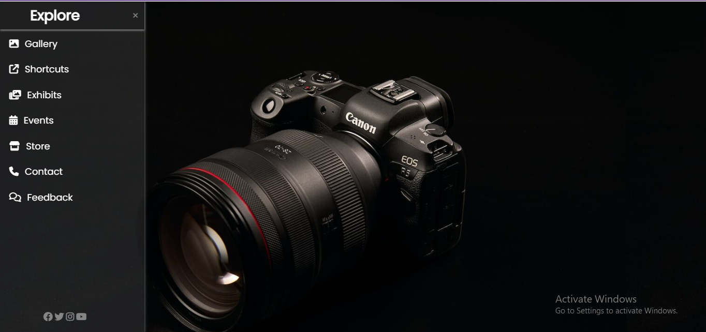

# 📌 Sidebar Navigation Menu (HTML & CSS)

## 📖 Description

This project is a responsive sidebar navigation menu built using **HTML and CSS**. It features a smooth toggle functionality implemented using the **CSS checkbox hack**, without using JavaScript.

---

## 🚀 Features

* Responsive sidebar design
* Toggle menu using checkbox (No JavaScript)
* Smooth animations using CSS transitions
* Modern UI with icons
* Clean and structured layout

---

## 🛠️ Technologies Used

* HTML5
* CSS3
* Google Fonts (Poppins)
* Font Awesome Icons

---

## 💡 How It Works

The sidebar is controlled using a hidden checkbox input. When the checkbox is checked, the sidebar becomes visible using CSS sibling selectors.

---

## 📂 Project Structure

* index.html
* index.css
* images (camera.jpg)

---

## ▶️ How to Run

1. Download or clone the repository
2. Open `index.html` in any browser
3. Click on the menu icon to open the sidebar

---

## 📸 Output

---

## ✨ Author

Kumkum Tyagi
